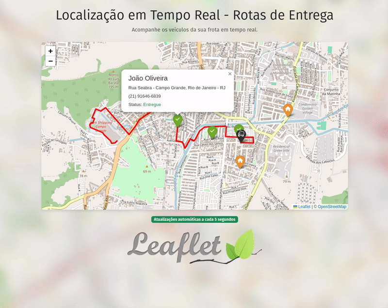

# Leaflet.js e Django - Estudos e Integração



Este repositório é um projeto de estudos para compreender como integrar o [Leaflet.js](https://leafletjs.com/) com o [Django](https://www.djangoproject.com/). O objetivo principal é criar uma simulação de movimentação de veículos e exibi-la em um mapa interativo com atualizações em tempo real.

## Funcionalidades

- Criação automática de 5 veículos com localização inicial aleatória.
- Atualização da localização dos veículos a cada 5 segundos, simulando o movimento dentro de um intervalo predefinido.
- Exibição das rotas dos veículos em um mapa utilizando Leaflet.js.

## Tecnologias Utilizadas

- **Backend**: Django
- **Frontend**: Leaflet.js, Bootstrap 5
- **Banco de Dados**: SQLite (configuração padrão para desenvolvimento)

## Como Executar o Projeto

### 1. Clone o Repositório

```bash
git clone https://github.com/Moscarde/django_leafletjs
cd django_leafletjs
```

### 2. Crie e Ative um Ambiente Virtual

```bash
python -m venv venv
source venv/bin/activate # No Windows: venv\Scripts\activate
```

### 3. Instale as Dependências

```bash
pip install -r requirements.txt
```

### 4. Execute as Migrações

```bash
python manage.py migrate
```

### 5. Popule o Banco de Dados

Utilize o comando personalizado para criar os veículos iniciais:

```bash
python manage.py create_vehicles
```

### 6. Inicie o Servidor de Desenvolvimento

```bash
python manage.py runserver
```

### 7. Acesse o comando de simular a movimentação dos veículos (em outro terminal)

```bash
python manage.py simulate_vehicle_movement
```

### 8. Acesse o Sistema

Abra seu navegador e acesse:

```
http://127.0.0.1:8000/
```

## Simulação de Movimento dos Veículos

O comando `python manage.py simulate_vehicle_movement` é responsável por randomizar a localização dos veículos a cada 5 segundos. Esse processo é integrado à aplicação para que o mapa seja atualizado automaticamente.

## Tela Inicial

O projeto exibe um mapa interativo com marcadores representando os veículos. As rotas dos veículos são traçadas à medida que eles se movem, proporcionando uma visualização clara e em tempo real.
