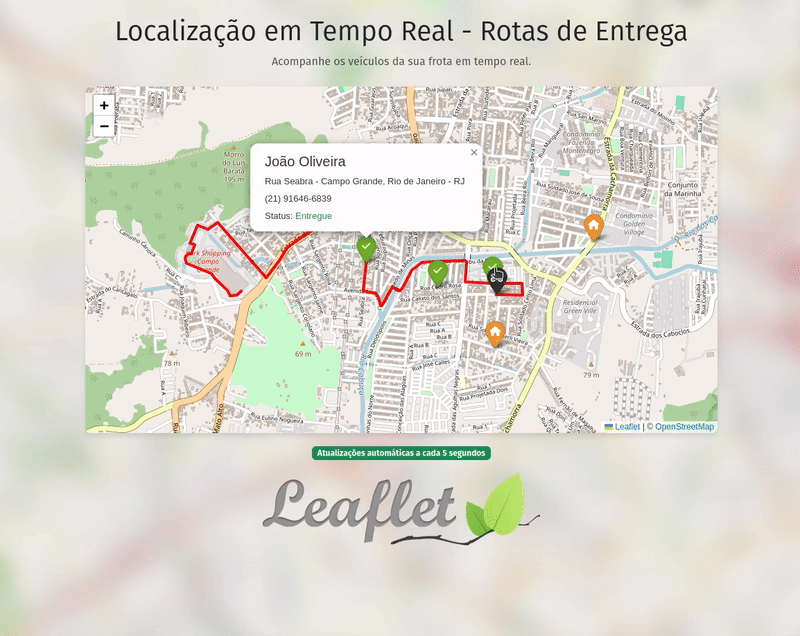

# Leaflet.js e Django - Estudos e Integração

<div align="center">
  
</div>

Este repositório é um projeto de estudos para compreender como integrar o [Leaflet.js](https://leafletjs.com/) com o [Django](https://www.djangoproject.com/). O objetivo principal é criar uma simulação de movimentação de veículos e exibi-la em um mapa interativo com atualizações em tempo real.

## Funcionalidades

- Simulação de movimentação de veículos em um mapa interativo.
- Atualização de estado dos pontos de entrega de acordo com a posição dos veículos.

## Tecnologias Utilizadas

- **Backend**: Django
- **Frontend**: Leaflet.js, Bootstrap 5
- **Banco de Dados**: SQLite (configuração padrão para desenvolvimento)

## Como Executar o Projeto

### 1. Clone o Repositório

```bash
git clone https://github.com/Moscarde/django_leafletjs
cd django_leafletjs
```

### 2. Crie e Ative um Ambiente Virtual

```bash
python -m venv venv
source venv/bin/activate # No Windows: venv\Scripts\activate
```

### 3. Instale as Dependências

```bash
pip install -r requirements.txt
```

### 4. Execute as Migrações

```bash
python manage.py migrate
```

### 5. Popule o Banco de Dados

Utilize o comando personalizado para criar os veículos iniciais:

```bash
python manage.py create_locations
```

### 6. Inicie o Servidor de Desenvolvimento

```bash
python manage.py runserver
```

### 7. Acesse o comando de simular a movimentação dos veículos (em outro terminal)

```bash
python manage.py simulate_route
```

### 8. Acesse o Sistema

Abra seu navegador e acesse:

```
http://127.0.0.1:8000/
```

## Simulação de Movimento dos Veículos

O comando `python manage.py simulate_route` é responsável por criar a simulação da progressão de uma rota de entrega de pedidos. Seu progresso é resetado toda vez que o comando é executado.

## Tela Inicial

O projeto exibe um mapa interativo com marcadores representando o veículo e os ponto de entrega. As rotas dos veículos são traçadas à medida que eles se movem, proporcionando uma visualização clara e em tempo real.


## Referências

Este projeto foi baseado em um minicurso do [canal BugBytes](https://www.youtube.com/@bugbytes3923) no YouTube. O vídeo pode ser acessado neste [link](https://www.youtube.com/watch?v=vBd9Yy3tQPo).